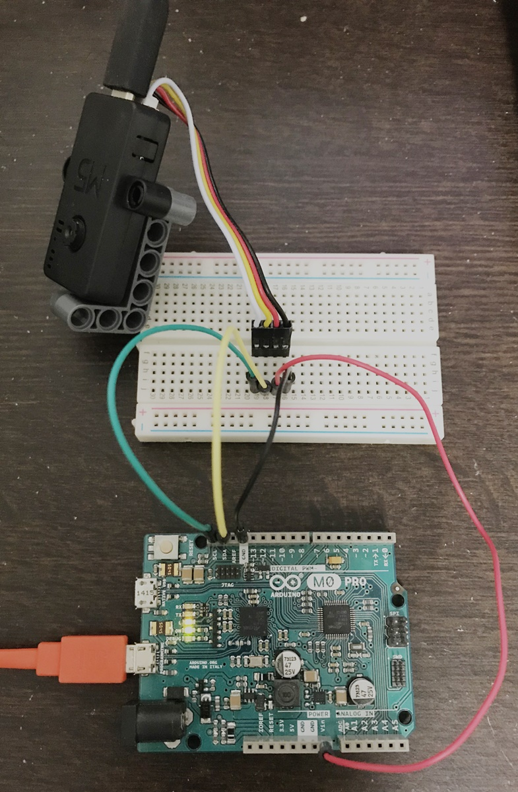
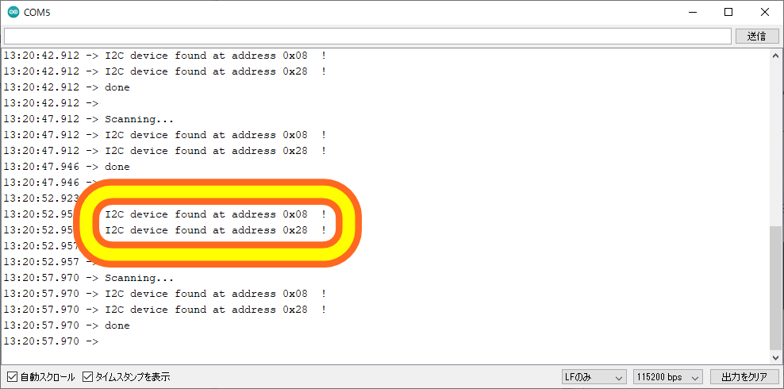
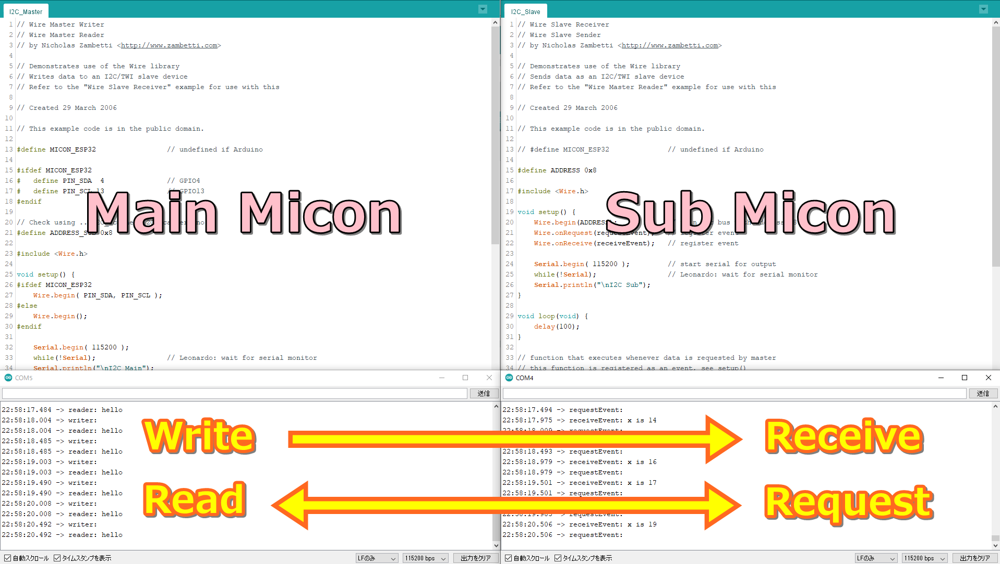

# I2C_Between_Arduino_and_ESP32
I2C communication between Arduino and ESP32 (ex. M5Camera).

## Preparation for connection

### Main microcomputer: M5Camera
Use of GROVE terminal.

### Sub microcomputer: Arduino M0 PRO

### How to connect

| M5Camera | Arduino M0 PRO |
| --- | --- |
| GND | GND |
| 5V | Vin |
| SDA (13) | SDA (16) |
| SCL (4) | SCL (17) |

## Find connected device addresses
1. Using a customized [I2C_Scanner.ino](I2C_Scanner/I2C_Scanner.ino) for ESP32.

Original file is [here](https://playground.arduino.cc/Main/I2cScanner/)

## I2C Communicate between microcomputers
1. Use [I2C_Main.ino](I2C_Main/I2C_Main.ino) and [I2C_Sub.ino](I2C_Sub/I2C_Sub.ino) that merges the following two files
- [Master Writer/Slave Receiver](https://www.arduino.cc/en/Tutorial/MasterWriter)
- [Master Reader/Slave Sender](https://www.arduino.cc/en/Tutorial/MasterReader)

2. Connect two microcomputers to PC.

3. Upload and check the behavior on the serial monitor

